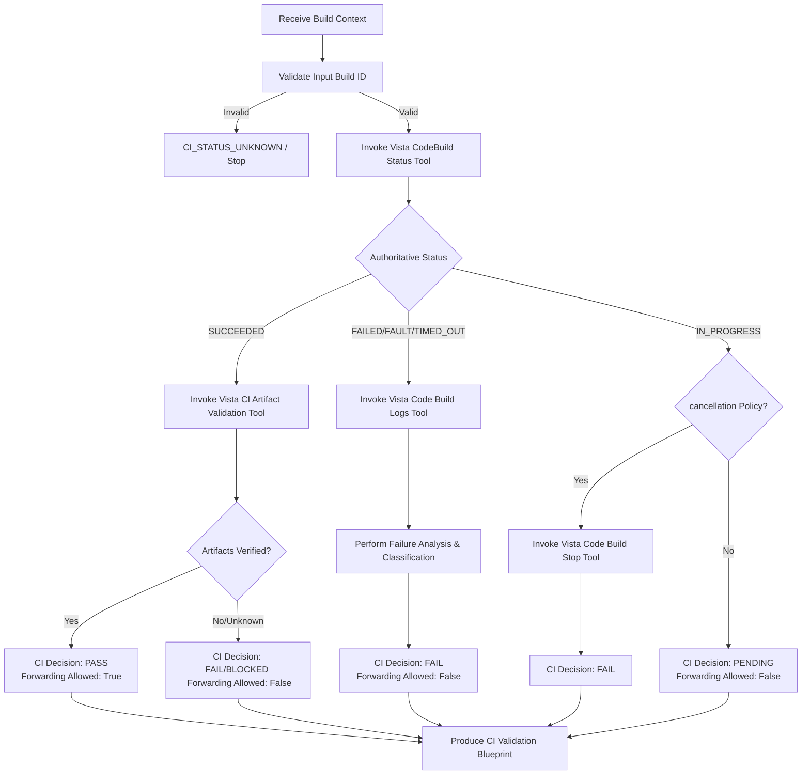

# AAVA Agent KT (Knowledge Transfer) - AWS CI Failure Handling And Validation Blueprint Agent

## 1. Agent Overview

* **Agent Name**: AWS CI Failure Handling And Validation Blueprint Agent
* **Owner**: AAVA Platform & Release Engineering Team
* **Purpose / Use Case**: Authoritatively validates AWS CodeBuild execution outcomes and build artifacts (ECR container images and S3 packages), collects failure evidence and logs when a build fails, manages controlled CI cancellation in accordance with policy, and produces a deterministic *CI Validation & Failure Handling Blueprint* for downstream processing.
* **Position in Workflow**: **Agent 4** (Operates exclusively at the Continuous Integration (CI) stage boundary, serving as a gatekeeper before downstream deployment agents are triggered).
* **Upstream / Downstream Agents**:
  * **Upstream**: 
  * **Downstream**: Deployment Agent (handles CD/deployment promotion only if the AWS CI Failure Handling And Validation Blueprint Agent produces a `PASS` decision).

---

## 2. Inputs & Outputs

* **Inputs**:
  * `build_id`: A unique AWS CodeBuild execution ID (e.g., `Salesloft:5b6e414e-2595-46a6-b647-9e123edd9df0`).
* **Input Source**: Previous Agent / API Trigger / User.
* **Output**:
  * *CI Validation & Failure Handling Blueprint*: A structured, deterministic Markdown/JSON package containing the CI decision (`PASS`, `FAIL`, `BLOCKED`, `PENDING`), build forwarding permission (`true`/`false`), and verified artifact metadata.
* **Output Consumer**: Next Agent (Build/Deployment Agent) / Jira / System Logs / Developer Notifications.

---

## 3. Tools & Components

* **Tools Used**:
  1. **Vista CodeBuild Status Tool**: Queries AWS CodeBuild for the authoritative execution status, phase durations, environment variables, and source metadata.
  2. **Vista CI Artifact Validation Tool**: Validates that backend and frontend ECR docker images tagged with the exact source revision (commit SHA) and the primary S3 zip artifact exist and match expectations.
  3. **Vista Code Build Logs Tool**: Downloads CloudWatch/S3 execution logs for failed, stopped, or timed-out builds to extract error and warning messages.
  4. **Vista Code Build Stop Tool**: Initiates a controlled stop on an active `IN_PROGRESS` build when timeout or cancellation policies are violated.
* **Knowledge Base**: Yes — `vista_ci_failure_handling_kb`
* **Guardrails**: No (We didn't use any guardrails)
* **MCP / External Integrations**: NA

---

## 4. Technology Stack

* **LLM / Model**: anthropic claude 4.5 sonnet
* **Framework / Platform**: AAVA Console (based on CrewAI)
* **Programming Language**: Python (v3.10+).
* **Other Technologies / Libraries**: `boto3` (AWS SDK), `pydantic` (Data validation and tool schemas), `urllib` (S3/ECR URI parsing).

---

## 5. Agent Workflow

Briefly explain the execution flow:
`Input (Build ID) → Validate ID → Query CodeBuild → Branch by Status (Succeeded / Failed / Running) → Artifact Validation / Log Analysis → Generate Blueprint Output`

### Key Steps:
1. **Validate Input**: Confirms a valid CodeBuild ID string exists.
2. **Query Authoritative Status**: Calls `Vista CodeBuild Status Tool` to retrieve execution state.
3. **Branch Handling**:
   * **SUCCEEDED**: Feeds the complete JSON output from the status tool directly to the `Vista CI Artifact Validation Tool`.
   * **FAILED/FAULT/TIMED_OUT**: Triggers `Vista Code Build Logs Tool` to extract exact errors.
   * **IN_PROGRESS**: Checks if cancellation rules apply; otherwise, exits with `PENDING`.
4. **Artifact Validation**: Confirms backend image, frontend image, and S3 deployable ZIP exist.
5. **Classify Failure**: If validation fails or the build fails, the agent classifies the root cause using the taxonomy (e.g. `ARTIFACT_VALIDATION_FAILURE`, `DEPENDENCY_FAILURE`, `COMPILE_FAILURE`).

---

## 6. Challenges & Solutions

| Challenge | Solution / Workaround |
| :--- | :--- |
| **Loose/Brittle Parsing of Tool Outputs** | Consolidated the input schema of `Vista CI Artifact Validation Tool` to accept the entire JSON string output of `Vista CodeBuild Status Tool`. The validation tool now uses robust utility parsers (`parse_s3_arn` and `parse_ecr_repository_from_uri`) internally rather than forcing the agent to parse fields. |
| **Risk of Stale Deployments (using `latest` tag)** | Implemented strict tag enforcement. The agent verifies image tags that exactly match the immutable `resolved_source_version` (commit SHA) and refuses to fall back to `latest`. |
| **Silent Failures / Missing Logs** | When CloudWatch logs are disabled on CodeBuild, the agent relies on ECR metadata and phase status codes, ensuring it outputs `UNKNOWN_FAILURE` or `ARTIFACT_VALIDATION_FAILURE` with a detailed explanation instead of crashing. |
| **AWS API Connectivity and Authentication Failures** | Wrapped SDK calls with custom exception handling to ensure credential, network, or rate-limit issues are marked as `EVIDENCE_RETRIEVAL_FAILURE` or `CI_STATUS_UNKNOWN` rather than failing the application build. |

---

## 7. AAVA-Specific Learnings

* **AAVA limitations encountered**: CrewAI agents can struggle with nested JSON parameters or variable types when executing tools sequentially. Supplying raw, structured tool-to-tool payloads is far more reliable.
* **Tool/Agent issues**: Passing ECR registry IDs and region names manually often resulted in mismatches. Relying on default AWS environment structures and parsing ECR repository URIs dynamically solved this mismatch.
* **Guardrail/KB issues**: No guardrails were used in AAVA Console. Enforcing strict fail-closed validations within the KB/tools is necessary to prevent unsafe promotions. Even if a build succeeds, missing artifacts must result in a `FAIL` status.
* **Important configuration or setup required**: AWS credential variables (`AWS_ACCESS_KEY_ID`, `AWS_SECRET_ACCESS_KEY`) and region (`eu-north-1`) must be configured within the tool environment or IAM profiles.

---

## 8. Testing & Current Status

* **Test Scenarios**:
  * **Scenario 1**: Succeeded Build + Valid Artifacts (ECR & S3 present) → Verifies `PASS` status.
  * **Scenario 2**: Succeeded Build + Missing ECR Tag (Artifact Validation Fail) → Verifies `FAIL`.
  * **Scenario 3**: Failed Compilation → Verifies log retrieval and categorization of `COMPILE_FAILURE`.
* **Edge Cases**:
  * Empty source versions or missing commit SHAs in build metadata.
  * CodeBuild logs disabled by configuration.
  * Access Denied (`403`) or Key Not Found (`404`) on S3 bucket.
* **Known Limitations**: Text-based credentials present as placeholders in current POC scripts.
* **Current Status**: Completed
* **Pending Improvements**: NA

---

## 9. Demo / KT Notes

* **Key Design Decision**: Strict separation of *Observation* (direct AWS API responses) and *Inference* (agent classifications). Inferences are never presented as observed facts.
* **Most Important Learning**: A successful build status in AWS CodeBuild does *not* equate to a successful CI process. Verify ECR container images and S3 deployment archives before concluding.
* **What the next developer should know**: `Vista CI Artifact Validation Tool` relies directly on parsing the JSON string output of `Vista CodeBuild Status Tool`. If you modify the JSON schema of the status tool, you must update the parsing logic in `Vista CI Artifact Validation Tool` accordingly.
* **Anything that needs to be improved**: Enhance the regex matching inside `Vista Code Build Logs Tool` to capture warnings, lint issues, and test run summaries.
