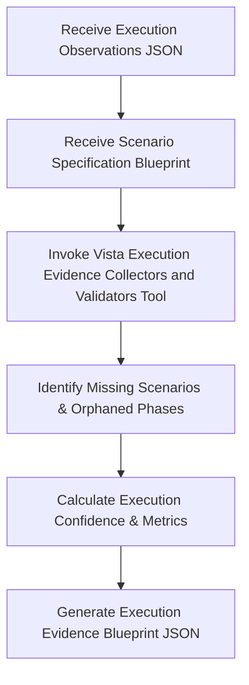

# AAVA Agent KT (Knowledge Transfer) - Vista Evidence Validations agent

## 1. Agent Overview

* **Agent Name**: Vista Evidence Validations agent
* **Owner**: AAVA Platform & Release Engineering Team
* **Purpose / Use Case**: Accurately validate execution observations and compile unaltered execution evidence using the Vista tool for audit and compliance purposes, ensuring no hallucinated metrics are passed downstream.
* **Position in Workflow**: **Agent 5** (Operates as the third intelligent agent in the Playwright Execution workflow).
* **Upstream / Downstream Agents**:
  * **Upstream**: Vista Playwright Executors agent (Agent 4)
  * **Downstream**: Vista Execution Evidence Result Analysis Agent (Agent 6)

---

## 2. Inputs & Outputs

* **Inputs**:
  * `Execution Observations JSON`: Raw execution results, console logs, and network metrics from the executor agent.
  * `Scenario Specification Blueprint`: The original baseline to trace executions back to requirements.
* **Input Source**: Previous Agents (Vista Playwright Executors agent - Agent 4 & Scenario Generation Agent).
* **Output**:
  * `Execution Evidence Blueprint`: A comprehensive structured document (JSON) detailing execution counts, missing scenarios, JS exceptions, timelines, traceability matrices, and confidence scores.
* **Output Consumer**: Vista Execution Evidence Result Analysis Agent (Agent 6).

---

## 3. Tools & Components

* **Tools Used**:
  1. **Vista Execution Evidence Collectors and Validators Tool**: Collects observations, cross-references them with the blueprint, injects placeholders for missing scenarios, calculates execution confidence, and formats the final structured evidence blueprint.
* **Knowledge Base**: Yes — `vista-playwright-execution-kb` (shared across the 3 execution sub-agents).
* **Guardrails**: No (We didn't use any guardrails)
* **MCP / External Integrations**: NA

---

## 4. Technology Stack

* **LLM / Model**: gpt 5.4
* **Framework / Platform**: AAVA Console (based on CrewAI)
* **Programming Language**: Python (v3.10+)
* **Other Technologies / Libraries**: `json`, `time`, `pydantic`, `crewai.tools.BaseTool`.

---

## 5. Agent Workflow

Briefly explain the execution flow:
`Input (Observations + Blueprint) → Validate Evidence Completeness → Reconcile Scenarios → Generate Evidence Blueprint`

### Key Steps:
1. **Input Normalization**: Ensure blueprints and observations strings are cleanly deserialized into dictionaries to handle LLM artifacts.
2. **Reconciliation**: Match actual executed scenarios against expected scenarios using the `Scenario Identifier` from the blueprint.
3. **Missing Data Handling**: Automatically inject `NOT_EXECUTED` records for scenarios or phases that were defined in the blueprint but missed during execution.
4. **Data Aggregation**: Compile timelines, interaction histories, JS exceptions, and network summaries into organized dictionaries.
5. **Confidence Scoring**: Assign execution status (`COMPLETE` vs `PARTIAL`) and confidence levels (`HIGH`, `MEDIUM`, `LOW`) based on evidence completeness and success rates.

---

## 6. Challenges & Solutions

| Challenge | Solution / Workaround |
| :--- | :--- |
| **Missing Scenarios Validation** | Execution failures could result in missing logs. The validator tool actively maps executions against the blueprint and flags unexecuted tests instead of silently ignoring them. |
| **Inconsistent Keys Across Agents** | Earlier agents use varying JSON keys (`id` vs `Scenario Identifier`). The tool implements defensive coding and explicit key lookups to handle structural discrepancies. |

---

## 7. AAVA-Specific Learnings

* **AAVA limitations encountered**: Context limits forced the separation of validation logic from execution. Validating large observation blocks directly via LLM prompts triggered hallucinations.
* **Tool/Agent issues**: Reconciling nested metadata requires the tool to check multiple locations for `execution_metadata` due to how the LLM might occasionally package JSON payloads.
* **Guardrail/KB issues**: No guardrails used. Relies on the shared KB `vista-playwright-execution-kb` to enforce data structure.

---

## 8. Testing & Current Status

* **Test Scenarios**:
  * **Scenario 1**: Complete Execution → All blueprint scenarios match observations. Generates `COMPLETE` status with `HIGH` confidence.
  * **Scenario 2**: Missing Scenarios → Injects `NOT_EXECUTED`, drops confidence, and flags status as `PARTIAL`.
* **Edge Cases**: Empty observations cleanly produce 0% executions and report appropriate traceability without fatal exceptions.
* **Known Limitations**: Does not attempt to retry failed scenarios; it strictly reports findings.
* **Current Status**: Completed
* **Pending Improvements**: NA

---

## 9. Demo / KT Notes

* **Key Design Decision**: By keeping validation isolated, we prevent the Executor agent from masking or hallucinating over its own runtime errors.
* **Most Important Learning**: Confidence scoring is strictly data-driven based on completeness of evidence, completely removing subjective LLM biases.
* **What the next developer should know**: The output from this agent is the definitive source of truth for the downstream Result Analysis Agent. Any missing fields here will cause the analysis agent to fail.
