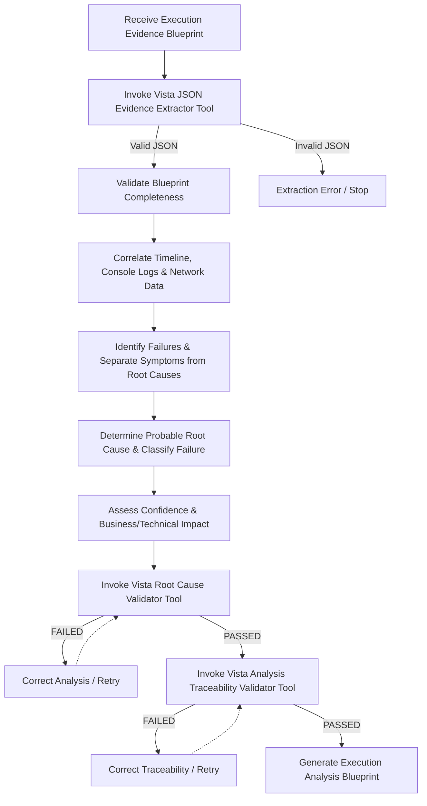

# AAVA Agent KT (Knowledge Transfer) - Vista Execution Evidence Result Analysis Agent

## 1. Agent Overview

* **Agent Name**: Vista Execution Evidence Result Analysis Agent
* **Owner**: AAVA Platform & Release Engineering Team
* **Purpose / Use Case**: Transforms a validated Execution Evidence Blueprint into a complete Execution Analysis Blueprint by analyzing execution observations, correlating evidence, identifying failures, determining probable root causes, classifying failures, and assessing confidence/business impact.
* **Position in Workflow**: **Agent 6** (Operates as the fourth intelligent agent in the AI Test Automation Workflow, serving as the core diagnostic engine).
* **Upstream / Downstream Agents**:
  * **Upstream**: Vista Evidence Validations agent (Agent 5) (provides the validated Execution Evidence Blueprint).
  * **Downstream**: Vista Recommendations Agent (Agent 7).

---

## 2. Inputs & Outputs

* **Inputs**:
  * `Execution Evidence Blueprint`: Authoritative execution observations, history, browser logs, console summaries, network logs, and execution timeline metadata.
* **Input Source**: Previous Agent (Vista Evidence Validations agent - Agent 5).
* **Output**:
  * `Execution Analysis Blueprint`: A complete diagnostic output detailing failure analysis, classified root causes, confidence assessments, business/technical impact, affected components, and recurring patterns.
* **Output Consumer**: Vista Recommendations Agent (Agent 7).

---

## 3. Tools & Components

* **Tools Used**:
  1. **Vista Root Cause Validator Tool**: Agentic Tool to validate that every Root Cause identified by the Result Analysis Agent is supported by the Execution Evidence Blueprint.
  2. **Vista JSON Evidence Extractor Tool**: Agentic Tool to extract and validate Execution Evidence Blueprint JSON from raw agent activity logs / execution outcomes.
  3. **Vista Analysis Traceability Validator Tool**: Agentic Tool to validate traceability across the complete execution analysis lifecycle.
* **Knowledge Base**: Yes — `vista-playwright-analysis-kb` (defines system roles, failure analysis methodologies, root cause classifications, confidence assessments, and blueprint handoffs).
* **Guardrails**: No (We didn't use any guardrails)
* **MCP / External Integrations**: NA

---

## 4. Technology Stack

* **LLM / Model**: gpt 5.4
* **Framework / Platform**: AAVA Console (based on CrewAI)
* **Programming Language**: Python (v3.10+)
* **Other Technologies / Libraries**: `pydantic` (tool inputs), `json`, `logging`.

---

## 5. Agent Workflow

Briefly explain the execution flow:
`Input (Execution Evidence Blueprint) → Validate Evidence → Correlate Evidence → Separate Symptoms from Root Cause → Classify Failures → Validate & Output Analysis Blueprint`

### Key Steps:
1. **Extract & Validate Evidence**: Runs the `Vista JSON Evidence Extractor Tool` to parse raw activity logs and output the Execution Evidence Blueprint.
2. **Correlate Observations**: Matches test step failures with browser console errors, JavaScript exception stacks, and network timing/status codes.
3. **Separate Symptoms from Causes**: Distinguishes the immediate observed failure (e.g. login failed) from the underlying root cause (e.g. database auth timed out).
4. **Classify & Estimate Impact**: Assigns a root cause category (e.g., API, Frontend, Database, Configuration) and assesses confidence level and business impact.
5. **Validate Correctness**: Executes `Vista Root Cause Validator Tool` to ensure the identified cause is backed by hard evidence.
6. **Validate Traceability**: Executes `Vista Analysis Traceability Validator Tool` to check execution-to-analysis linkages.

---

## 6. Challenges & Solutions

| Challenge | Solution / Workaround |
| :--- | :--- |
| **Separating Symptoms from Root Causes** | The methodology separates symptom observations (unexpected redirects, timeouts) from technical causes, ensuring that the primary source error is isolated first rather than listing downstream cascades. |
| **Parsing raw, unstructured agent logs** | Built the `Vista JSON Evidence Extractor Tool` to programmatically extract and normalize execution telemetry from raw execution files, avoiding manual parsing errors by the LLM. |
| **Speculative / Unsubstantiated Root Causes** | Enforced verification through the `Vista Root Cause Validator Tool`, which fails the validation if the agent assigns a root cause without direct console/network evidence. |

---

## 7. AAVA-Specific Learnings

* **AAVA limitations encountered**: Complex execution logs can cause LLM context windows to overflow or lead to hallucinated error causes. Tools must summarize network and console payloads beforehand.
* **Tool/Agent issues**: Analysis traceability cannot rely on LLM prompts alone; validations require programmatic checks in `Vista Analysis Traceability Validator Tool`.
* **Guardrail/KB issues**: No guardrails were used in AAVA Console; correctness is maintained through the three validator tools.
* **Important configuration or setup required**: The agent needs read permissions on raw playwright execution artifacts, screenshots, and logs in the pipeline workspace.

---

## 8. Testing & Current Status

* **Test Scenarios**:
  * **Scenario 1**: Valid Execution Evidence with exact network error codes → Verifies accurate classification of `API_FAILURE`.
  * **Scenario 2**: Inconsistent or contradictory logs → Verifies that the agent assigns a low confidence rating and registers unknown areas.
  * **Scenario 3**: Execution data missing mandatory console summary → Verifies that extraction fails and blocks the pipeline.
* **Edge Cases**:
  * Empty timeline logs; intermittent network timeouts; dual failures in both frontend and backend.
* **Known Limitations**: The validator tools do not perform code modifications or run scenarios.
* **Current Status**: Completed
* **Pending Improvements**: NA

---

## 9. Demo / KT Notes

* **Key Design Decision**: The agent serves strictly as a diagnostic engine (Evidence Analysis Engine). It does not recommend fixes or generate code, ensuring clean separation of concerns before Agent 7 runs.
* **Most Important Learning**: Confidence assessments are based on evidence density. High confidence requires direct, unambiguous error outputs (like exceptions or network 500s).
* **What the next developer should know**: The `Vista Recommendations Agent` (Agent 7) relies directly on the JSON structure of the `Execution Analysis Blueprint` produced here.
* **Anything that needs to be improved**: Build automated triggers to query external service health endpoints when network timeouts are detected.
