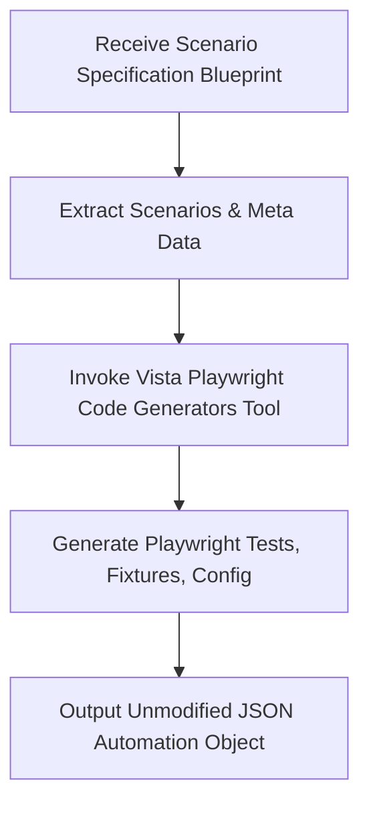

# AAVA Agent KT (Knowledge Transfer) - Vista Playwright Code generator agent

## 1. Agent Overview

* **Agent Name**: Vista Playwright Code generator agent
* **Owner**: AAVA Platform & Release Engineering Team
* **Purpose / Use Case**: Convert a Scenario Specification Blueprint into a Playwright automation JSON object using the Vista Playwright Code Generator Tool and return the unmodified JSON output.
* **Position in Workflow**: **Agent 3** (Operates as the first intelligent agent in the Playwright Execution workflow).
* **Upstream / Downstream Agents**:
  * **Upstream**: Scenario Generation Agent
  * **Downstream**: Vista Playwright Executors agent (Agent 4)

---

## 2. Inputs & Outputs

* **Inputs**:
  * `Scenario Specification Blueprint`: A validated blueprint containing scenario metadata, execution profiles, sequence, automation hints, and expected outcomes.
* **Input Source**: Previous Agent (Scenario Generation Agent).
* **Output**:
  * `Playwright Automation JSON Object`: An unmodified JSON string/object containing the generated Playwright automation scripts (tests, fixtures, config) and metadata.
* **Output Consumer**: Vista Playwright Executors agent (Agent 4).

---

## 3. Tools & Components

* **Tools Used**:
  1. **Vista Playwright Code Generators Tool**: Transforms the Scenario Specification Blueprint into executable Playwright automation. Responsibilities include generating Playwright Tests, Page Objects, Fixtures, Utilities, and Automation Metadata.
* **Knowledge Base**: Yes — `vista-playwright-execution-kb` (shared across the 3 execution sub-agents).
* **Guardrails**: No (We didn't use any guardrails)
* **MCP / External Integrations**: NA

---

## 4. Technology Stack

* **LLM / Model**: gpt 5.4
* **Framework / Platform**: AAVA Console (based on CrewAI)
* **Programming Language**: Python (v3.10+)
* **Other Technologies / Libraries**: `json`, `re`, `pydantic`, `crewai.tools.BaseTool`.

---

## 5. Agent Workflow

Briefly explain the execution flow:
`Input (Scenario Blueprint) → Parse Blueprint → Invoke Code Generator Tool → Return Unmodified JSON`

### Key Steps:
1. **Validate Input**: Ensure Scenario Specification Blueprint and scenarios exist.
2. **Code Generation**: Use the tool to map scenario IDs (e.g., AUTH-001, DASH-001) to explicit Playwright implementation blocks.
3. **Assemble Code**: Construct `playwright.config.ts`, `fixtures.ts`, and `scenarios.spec.ts`.
4. **Return JSON**: Return the bundled automation as an unmodified JSON object for execution.

---

## 6. Challenges & Solutions

| Challenge | Solution / Workaround |
| :--- | :--- |
| **Hallucination Issues** | The original combined execution agent hallucinated logic when trying to generate, execute, and evaluate in one go. The workflow was strictly segregated into 3 isolated agents. |
| **Context Window Limitation** | Passing blueprints, generating code, executing it, and observing evidence exceeded context limits. Segregating agents resolved this by distributing the cognitive load. |

---

## 7. AAVA-Specific Learnings

* **AAVA limitations encountered**: CrewAI agents struggled to maintain context when a single agent was tasked with generating code, executing it via a terminal, and validating the output.
* **Tool/Agent issues**: Code generators must output raw JSON reliably so that downstream executor agents do not fail parsing it.
* **Guardrail/KB issues**: No guardrails used; reliance on rigid tool outputs. Shared `vista-playwright-execution-kb` maintains consistency.

---

## 8. Testing & Current Status

* **Test Scenarios**:
  * **Scenario 1**: Valid Blueprint → Tool maps scenario IDs and returns complete JSON block.
  * **Scenario 2**: Missing Blueprint data → Tool returns error state in JSON.
* **Edge Cases**: Handling string vs dict inputs gracefully within the tool.
* **Known Limitations**: Compilation or syntax errors are not detected by this agent; they are only caught during execution by the downstream agent.
* **Current Status**: Completed
* **Pending Improvements**: NA

---

## 9. Demo / KT Notes

* **Key Design Decision**: Segregating generation from execution to solve hallucination and context window limits.
* **Most Important Learning**: Passing raw JSON between agents is more reliable than passing raw code strings that the LLM might attempt to format or alter.
* **What the next developer should know**: This agent performs *no execution* and *no analysis*. It strictly converts the blueprint to Playwright code.
