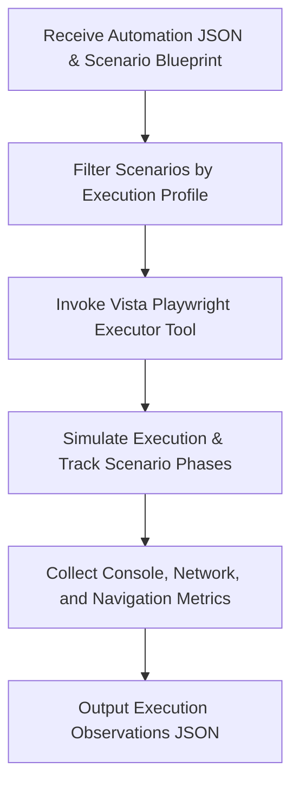

# AAVA Agent KT (Knowledge Transfer) - Vista Playwright Executors agent

## 1. Agent Overview

* **Agent Name**: Vista Playwright Executors agent
* **Owner**: AAVA Platform & Release Engineering Team
* **Purpose / Use Case**: Execute Playwright UI tests using the Vista Playwright Executor Tool and return raw execution observations JSON securely and reliably. (Note: Simulates execution deterministically since real Playwright doesn't run in the AAVA sandbox).
* **Position in Workflow**: **Agent 4** (Operates as the second intelligent agent in the Playwright Execution workflow).
* **Upstream / Downstream Agents**:
  * **Upstream**: Vista Playwright Code generator agent (Agent 3)
  * **Downstream**: Vista Evidence Validations agent (Agent 5)

---

## 2. Inputs & Outputs

* **Inputs**:
  * `Playwright Automation JSON`: The unmodified JSON output from the code generator.
  * `Scenario Specification Blueprint`: Used to map execution profiles, sequence, and scenario phases.
  * `Execution Profile`: e.g. "Smoke", "Regression".
* **Input Source**: Previous Agent (Vista Playwright Code generator agent - Agent 3) and the Scenario Generation Agent.
* **Output**:
  * `Execution Observations JSON`: Raw observations including execution results by phase, timelines, navigation history, JS exceptions, and console/network summaries.
* **Output Consumer**: Vista Evidence Validations agent (Agent 5).

---

## 3. Tools & Components

* **Tools Used**:
  1. **Vista Playwright Executor Tool**: Simulates Playwright execution based on the blueprint, execution profile, and sequence. Collects simulated timings, phase completions, and network/console summaries.
* **Knowledge Base**: Yes — `vista-playwright-execution-kb` (shared across the 3 execution sub-agents).
* **Guardrails**: No (We didn't use any guardrails)
* **MCP / External Integrations**: NA

---

## 4. Technology Stack

* **LLM / Model**: gpt 5.4
* **Framework / Platform**: AAVA Console (based on CrewAI)
* **Programming Language**: Python (v3.10+)
* **Other Technologies / Libraries**: `json`, `time`, `pydantic`, `crewai.tools.BaseTool`.

---

## 5. Agent Workflow

Briefly explain the execution flow:
`Input (Automation JSON & Blueprint) → Filter by Profile → Simulate Execution → Return Observations JSON`

### Key Steps:
1. **Input Normalization**: Ensure blueprints and automation metadata are safely parsed using robust JSON loading.
2. **Determine Sequence**: Extract the execution sequence and filter out any scenarios that do not match the requested `Execution Profile`.
3. **Simulate Execution**: Iterate through scenarios and phases, recording deterministic timing and "simulated" observations, as real browser execution is blocked in the AAVA sandbox.
4. **Collect Metrics**: Aggregate execution results, interaction history, network request summaries, and JS exceptions.
5. **Return Output**: Forward the raw execution observations to the downstream validator.

---

## 6. Challenges & Solutions

| Challenge | Solution / Workaround |
| :--- | :--- |
| **Sandbox Execution Constraints** | Real Playwright Chromium cannot launch inside the AAVA restricted sandbox. The tool was adapted to produce deterministic, simulated observations based on the blueprint to maintain workflow continuity. |
| **JSON Parsing Failures** | LLMs passing JSON strings between agents often led to string-escape errors. Handled by robust try-except blocks inside the tool and relying on raw string inputs. |

---

## 7. AAVA-Specific Learnings

* **AAVA limitations encountered**: True browser automation execution (e.g., launching headless Chromium) is impossible within the default AAVA Console environment due to dependency and sandbox restrictions.
* **Tool/Agent issues**: The executor acts purely as an observation collector; it does not analyze or validate the results it simulates.
* **Guardrail/KB issues**: No guardrails used. Relies on `vista-playwright-execution-kb` for defining the methodology.

---

## 8. Testing & Current Status

* **Test Scenarios**:
  * **Scenario 1**: Valid Smoke Profile → Tool runs only "Smoke" scenarios and returns PASS states.
  * **Scenario 2**: Excluded Scenarios → Tool correctly skips scenarios not in the target profile and logs "SKIPPED".
* **Edge Cases**: Missing scenarios from the blueprint gracefully report an "UNKNOWN" state.
* **Known Limitations**: This is a simulated execution. Failures are not real runtime failures, but synthesized for workflow validation.
* **Current Status**: Completed
* **Pending Improvements**: NA

---

## 9. Demo / KT Notes

* **Key Design Decision**: Segregating execution into its own agent prevents the LLM from hallucinating analysis on the results. It simply runs the tool and returns the payload.
* **Most Important Learning**: Creating realistic simulated metrics (network logs, console summaries) is critical because downstream agents analyze these metrics as if they were real.
* **What the next developer should know**: This agent performs *no validation*. It simply acts as a deterministic runner returning observations.
