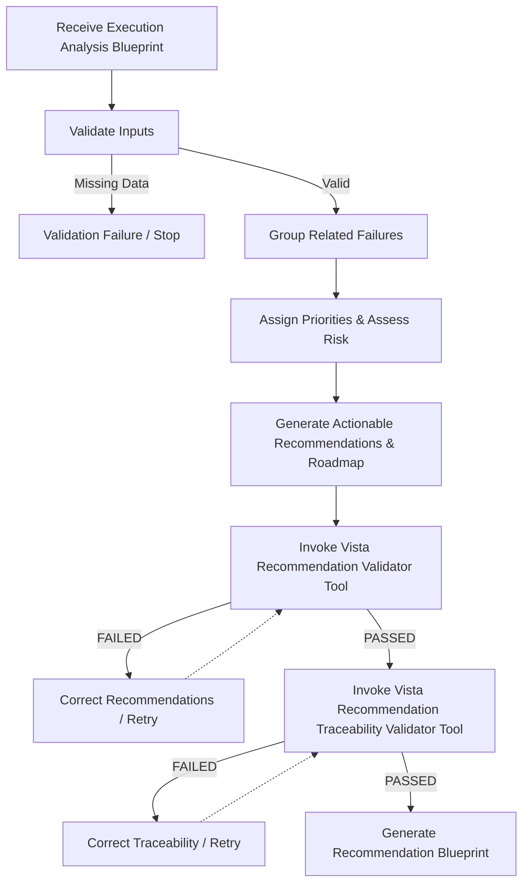

# AAVA Agent KT (Knowledge Transfer) - Vista Recommendations Agent

## 1. Agent Overview

* **Agent Name**: Vista Recommendations Agent
* **Owner**: AAVA Platform & Release Engineering Team
* **Purpose / Use Case**: Transforms a validated Execution Analysis Blueprint into a structured Recommendation Blueprint by generating practical, evidence-driven engineering recommendations, prioritizing implementation activities, and organizing engineering work without performing Root Cause Analysis or executing automation directly.
* **Position in Workflow**: **Agent 7** (Operates as the fifth and final intelligent agent in the AI Test Automation Workflow, serving as the final decision support engine).
* **Upstream / Downstream Agents**:
  * **Upstream**: Vista Execution Evidence Result Analysis Agent (Agent 6) (provides the validated Execution Analysis Blueprint).
  * **Downstream**: None

---

## 2. Inputs & Outputs

* **Inputs**:
  * `Execution Analysis Blueprint`: Structured data containing failure analysis, root cause details, business/technical impact assessments, affected components, and recurring patterns.
* **Input Source**: Previous Agent (Vista Execution Evidence Result Analysis Agent - Agent 6).
* **Output**:
  * `Recommendation Blueprint`: A detailed markdown/JSON package listing prioritized recommendations, implementation roadmaps, and traceability metrics.
* **Output Consumer**: External systems, Jira boards, Azure DevOps, and engineering dashboard notifications.

---

## 3. Tools & Components

* **Tools Used**:
  1. **Vista Recommendation Validator Tool**: Validates recommendation quality, grouping logic, and priority consistency against the Execution Analysis Blueprint to ensure they solve verified issues, not assumptions.
  2. **Vista Recommendation Traceability Validator Tool**: Validates that every recommendation and roadmap item can be traced back through the entire workflow chain (from application blueprint, to test strategy, scenario specifications, and execution evidence).
* **Knowledge Base**: Yes — `vista-playwright-recommendation-kb` (defines system roles, prioritization frameworks, and blueprint structures).
* **Guardrails**: No (We didn't use any guardrails)
* **MCP / External Integrations**: NA

---

## 4. Technology Stack

* **LLM / Model**: gpt 5.4
* **Framework / Platform**: AAVA Console (based on CrewAI)
* **Programming Language**: Python (v3.10+)
* **Other Technologies / Libraries**: `pydantic` (tool inputs), `json`, `logging`.

---

## 5. Agent Workflow

Briefly explain the execution flow:
`Input (Execution Analysis) → Input Validation → Group Related Failures → Prioritize Recommendations → Validate Recommendations & Traceability → Generate Blueprint`

### Key Steps:
1. **Validate Input**: Confirm that the Execution Analysis Blueprint and all mandatory sections (RCA, summary, impact assessments) exist.
2. **Group Findings**: Consolidate related failures (such as multiple database connection fails) into single recommendations to prevent redundancy.
3. **Prioritize & Risk Assessment**: Order recommendations based on technical/business impacts and assign risk ratings.
4. **Validate Recommendations**: Execute `Vista Recommendation Validator Tool` to ensure the generated priorities and roadmap conform to the blueprint.
5. **Validate Traceability**: Run the `Vista Recommendation Traceability Validator Tool` to check the end-to-end lineage.
6. **Generate Blueprint**: Output the final blueprint for rendering on downstream systems.

---

## 6. Challenges & Solutions

| Challenge | Solution / Workaround |
| :--- | :--- |
| **Speculative / Guessed Fixes on Low Confidence Analysis** | The agent is designed to recommend "Further Investigation" rather than proposing speculative code fixes when evidence is inconclusive or confidence is low. |
| **Duplicate & Repetitive Recommendations** | Grouping logic was introduced to group related test failures. Rather than opening five tickets for a single API timeout, the agent merges them into a consolidated recommendation. |
| **Lineage and Traceability Breaks** | Integrated strict validation checks inside the `Vista Recommendation Traceability Validator Tool` to verify references to previous blueprints, ensuring that no orphan recommendations exist. |

---

## 7. AAVA-Specific Learnings

* **AAVA limitations encountered**: CrewAI agents can generate overly broad recommendations without clear ownership. The KB enforces structure so recommendations are concrete.
* **Tool/Agent issues**: Validating multi-stage references requires separate validator tools; attempting to perform traceability checks purely via prompt logic results in missed reference errors.
* **Guardrail/KB issues**: No guardrails were used in AAVA Console; structural validation and completeness checks are entirely performed by tools.
* **Important configuration or setup required**: The environment must have access to all prior 5 stage blueprints in the pipeline workspace to perform the end-to-end traceability check.

---

## 8. Testing & Current Status

* **Test Scenarios**:
  * **Scenario 1**: Execution Blueprint with Complete RCA → Verifies that all priorities and roadmaps are correctly created.
  * **Scenario 2**: Missing Mandatory Fields in Analysis → Verifies the agent stops and returns a validation error.
  * **Scenario 3**: Broken Reference Chain → Verifies the traceability tool detects and reports the broken link.
* **Edge Cases**:
  * Broken reference links in the application configuration.
  * Low confidence classifications in prior runs.
* **Known Limitations**: The validator tools check correctness but do not automatically repair missing fields or references.
* **Current Status**: Completed
* **Pending Improvements**: NA

---

## 9. Demo / KT Notes

* **Key Design Decision**: Strict separation of the Decision Engine (the agent) and Validation Engines (the validator tools).
* **Most Important Learning**: Action items in the roadmap must be structured chronologically (Immediate, Short-Term, Long-Term) to be useful to development teams.
* **What the next developer should know**: The output Recommendation Blueprint is intermediate structured data. Rendering, issue creations, or notifications on external systems (e.g. Jira dashboard) rely directly on this output structure.
* **Anything that needs to be improved**: Implement an automated webhook tool to open Jira issues directly based on the roadmap.
